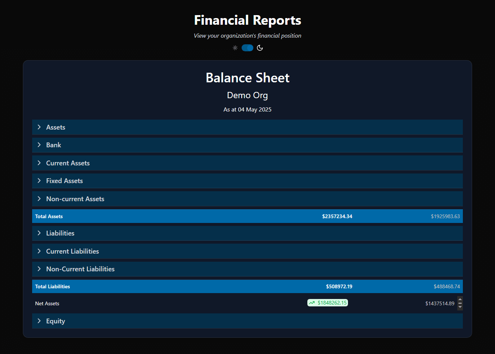
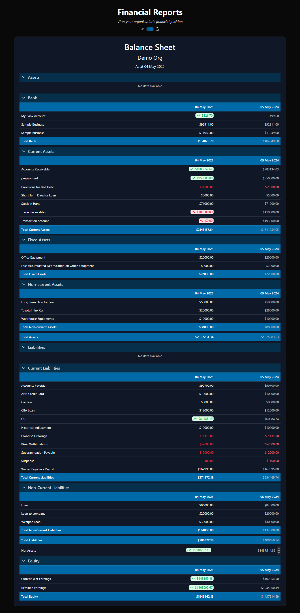
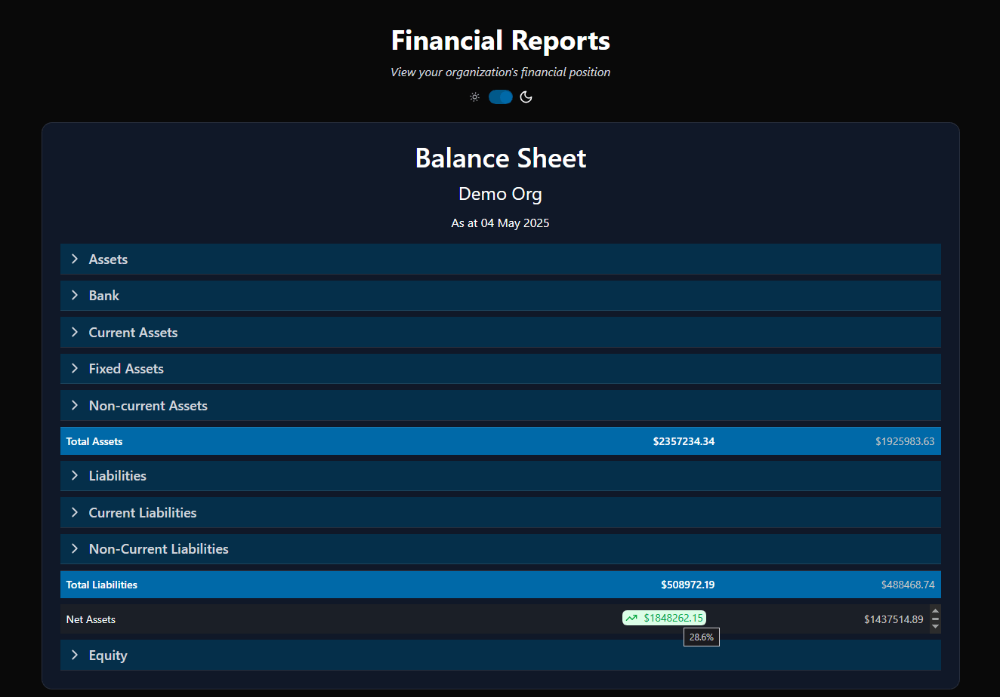
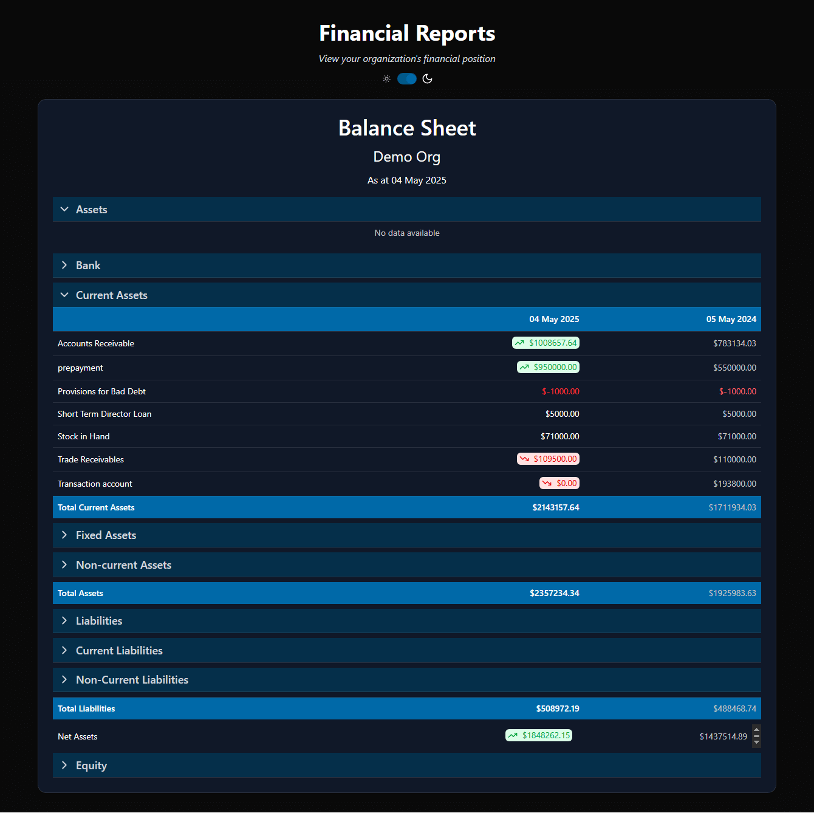
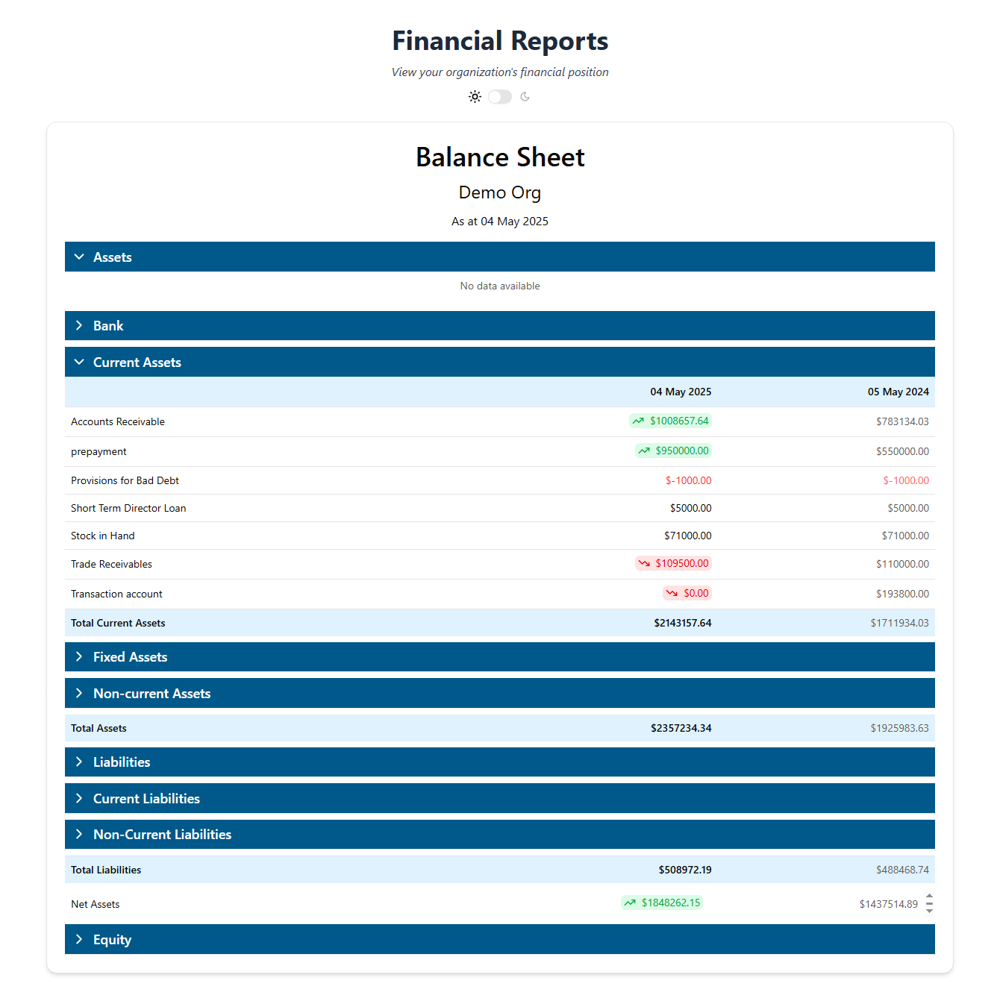

# 💰 Show Me The Money – Xero Balance Sheet Viewer

A simple full-stack, one-page application to display the **Balance Sheet Report** from [Xero](https://developer.xero.com/documentation/api/accounting/reports#balance-sheet) using a [mock API](https://hub.docker.com/r/jaypeng2015/show-me-the-money).

> 📌 This project was developed as part of a technical interview task.

## ✨ Highlights

- 📊 Beautifully formatted UI using **Shadcn UI**, **Tailwind CSS**, and **Lucide Icons**
- 📈 Real-time financial comparison chips (2024 vs. 2025) with color-coded trends and percentage tooltips
- 📁 Single-page frontend using **React 19 + TypeScript + Vite**
- 🔄 API state management with **TanStack React Query**
- ⏳ Includes **loading skeletons** and robust **error handling**
- 🐳 Seamlessly integrated using **Docker Compose**

> ✅ Tip: This full-stack app is designed to be run via **Docker Compose**. Running the frontend container automatically starts all required services — Backend + Mock API.

---

## 🖼️ Screenshots

Screenshots of the working app UI are available in the project root to visually demonstrate the financial table, chip indicators, hover states, and collapsible layout.

```md





```

## 📦 Tech Stack

| Layer      | Tech Stack                                                                     |
| ---------- | ------------------------------------------------------------------------------ |
| Frontend   | React 19, TypeScript, Vite, Shadcn UI, Tailwind CSS, Lucide Icons, React Query |
| Backend    | FastAPI, Python 3.12, Pydantic                                                 |
| API Source | Mock Xero Balance Sheet API (Docker image)                                     |
| Testing    | Pytest (backend), Jest (frontend)                                              |
| DevOps     | Docker, Docker Compose                                                         |

---

## 📦 Project Structure

```php
show-me-the-money/
├── backend/               # FastAPI backend service
│   ├── main.py            # Entry point for the FastAPI app
│   ├── requirements.txt   # Python dependencies
│   └── ...                # Other backend modules (e.g., routes, services, tests)
│
├── frontend/              # React + TypeScript frontend
│   ├── src/               # Source code for frontend
│   ├── public/            # Static assets
│   ├── index.html         # Main HTML file
│   └── ...                # Config files (vite.config.ts, tsconfig.json, etc.)
│
├── docker-compose.yml     # Docker Compose file to run all services
├── README.md              # Project documentation
└── .gitignore             # Git ignore rules
```

## 🐳 Getting Started with Docker

### 1. Clone the repo

```bash
git clone https://github.com/nomaanulhasan/show-me-the-money.git
cd show-me-the-money
```

### 2. Run all services using Docker Compose

```bash
docker-compose up --build
```

### 3. Access the app

Frontend: http://localhost:5173

Backend API: http://localhost:8000

Mock Xero API: http://localhost:3000/api.xro/2.0/Reports/BalanceSheet

## 📊 Features

- Fetches Balance Sheet data from a mock Xero API
- Clean table layout to display financial data
- Error handling and loading indicators
- Unit-tested backend and frontend
- Dockerized setup for easy deployment

## 🧪 Running Tests

Backend (Python/FastAPI):

```bash
cd backend
pytest
```

## Frontend (React):

```bash
cd frontend
npm install
npm test
```

## 📝 Notes

- Authentication is mocked; no real Xero credentials are needed.
- API endpoint used: /api.xro/2.0/Reports/BalanceSheet

## 📫 Contact

Built with ❤️ by [Syed NomanulHasan](https://nomaanulhasan.com)

For any questions related to this project, please reach out via GitHub or email.
